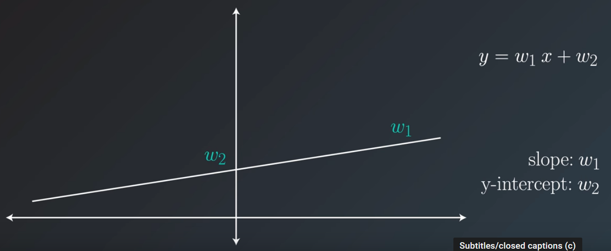
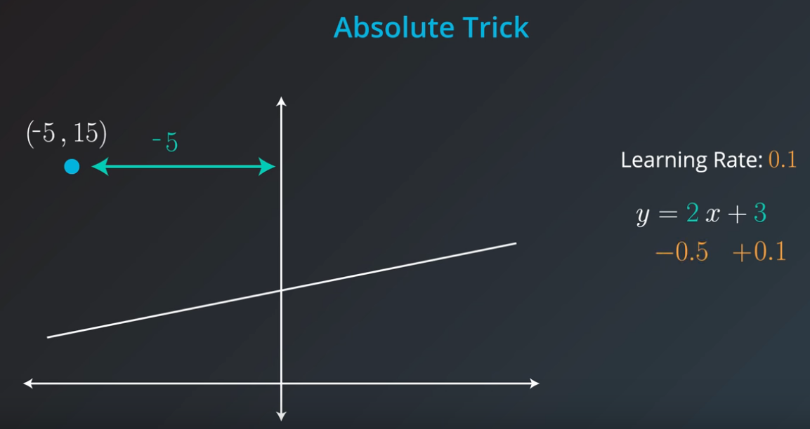
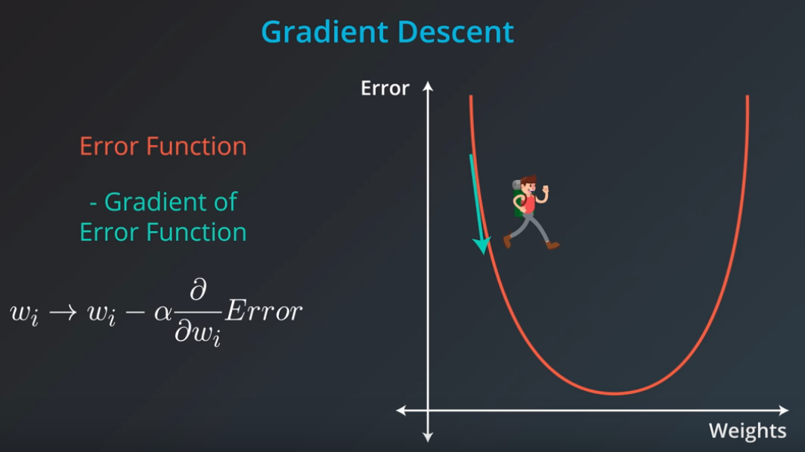

# ND025 - Supervised Learning

#### Tags
* Author : AH Uyekita
* Title  :  _Linear Regression_
* Date   : 22/02/2019
* Course : Data Scientist Nanodegree Program
    * COD    : ND025
    * **Instructor:** Luis Serrano

***

## Linear Regression

The two main families of *predictives* machine learning algorithms:

* Classification;
    * Answers question: `Yes` or `No`, Spam/not, Sick/not;
* Regression.
    * Answers question: How much.

This section is all about the **Linear Regression**.

### Line Equation

Recall the line equation in Figure 1.

Where:

* $w_1$: slope, and;
* $w_2$: intercept.

$$y = w_1 x + w_2 \tag{1}$$

### Moving the Line

The objective to move a line (changing the slope and intercept) is to fit that line to pass through the "target" point or to be as closer as possible to it.

Increasing $w_1$ (slope) the line will rotate around the $w_2$, and increasing $w_2$ (intercept) the line will be shift keeping the same slope.

There are two "strategies" to performs this line adjutment:

* Absolute Trick, and;
* Square Trick.

The strategy should be used sistematicaly until a certain condition is satisfied and the process ends.

#### Absolute Trick

The easiest way to adjust the line to fit the point is adding or subtracting a constant value of the intercept and slope. For instance, you can add `+1` to the slope and `+1` to the intercept and evaluate if the new line is closer to the point.

$$y = (w_1 + 1) \cdot x + (w_2 + 1) \tag{2}$$

Due to the `+1` is "too much" in term of slope, it is advisable to use a small value, instead of a huge value because you can "pass" the point. The $\alpha$, also called **learning rate**, is used to convert the `+1` in a small value. Assuming $\alpha$ as 0.01.

$$y = (w_1 + 1 \cdot \alpha ) \cdot x + (w_2 + 1 \cdot \alpha ) \tag{3}$$

As you can see, equation (3) will only work if the point to be fitted is above the line. Figure 2 shows it.

<em>Figure 2 - Example of Absolute Trick.</em>

We could fix it changing the operation of adding to subtracting.

$$y = (w_1 - 1 \cdot \alpha ) \cdot x + (w_2 - 1 \cdot \alpha ) \tag{4}$$

Unfortunately, equation (4) will not work if the point is in the second or third quadrants. Figure 3 shows an example of it.

<em>Figure 3 - Second Quadrant Issue.</em>

For this reason, the $p$ value is conveniently used to fit the line. When the $p$ is positive the slope should have $\alpha$ added and when it is negative the $\alpha$ should be subtracted to the slope.

$$y = (w_1 + p \cdot \alpha ) \cdot x + (w_2 + \alpha ) \tag{5}$$

This is an Example of Absolute Trick.

<em>Figure 4 - Absolute Trick Numeric Example.</em>

#### Square Trick

The Square trick is similar to the Absolute with the difference of also uses the $q$ value of the "target" point $(p,q)$ in the process to fit the line closer to the target.

In this strategy we going to use the difference between $q$ and the closest point from the line to it, thw $q'$, so what we are going to use is the $(q-q')$. Figure 5 shows it.

<em>Figure 5 - Using the q and q'.</em>

Equation (6) shows the new formulation.

$$y = (w_1 + p \cdot (q - q') \cdot \alpha ) \cdot x + (w_2 + (q - q') \cdot \alpha ) \tag{6}$$

**Example:**

<em>Figure 6 - Square Trick Numeric Example.</em>

The advantages of this approach are the negatives values and points in second quadrants are all contemplated in a single formulation.

### Gradient Descent

<em>Figure 7 - Gradient Descent.</em>

.
