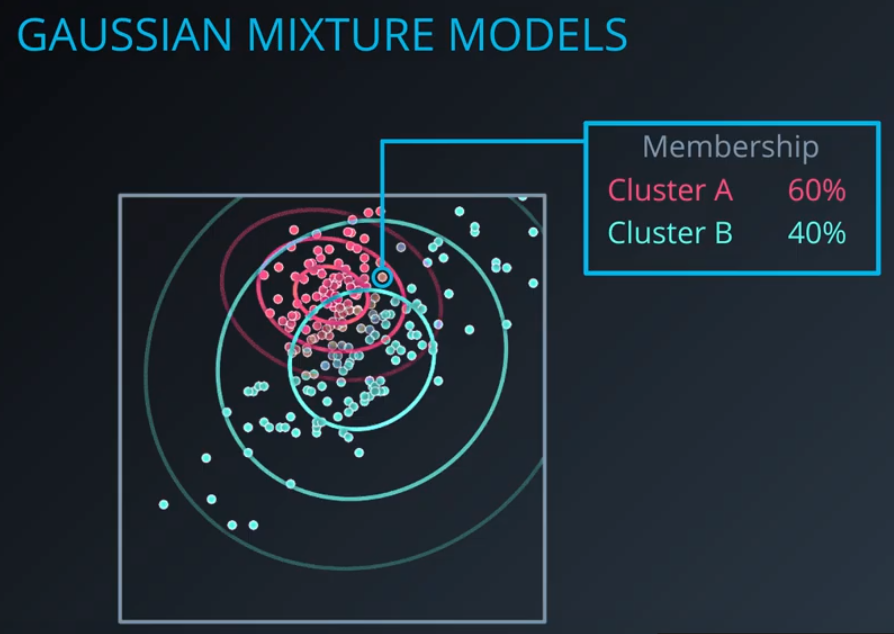
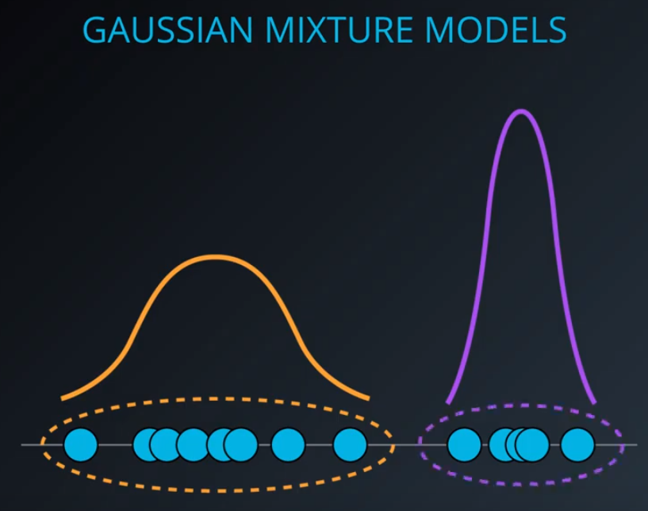
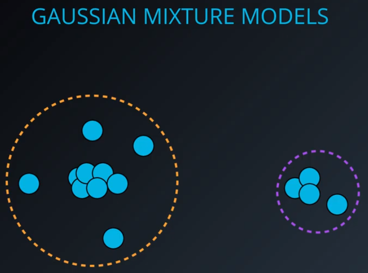
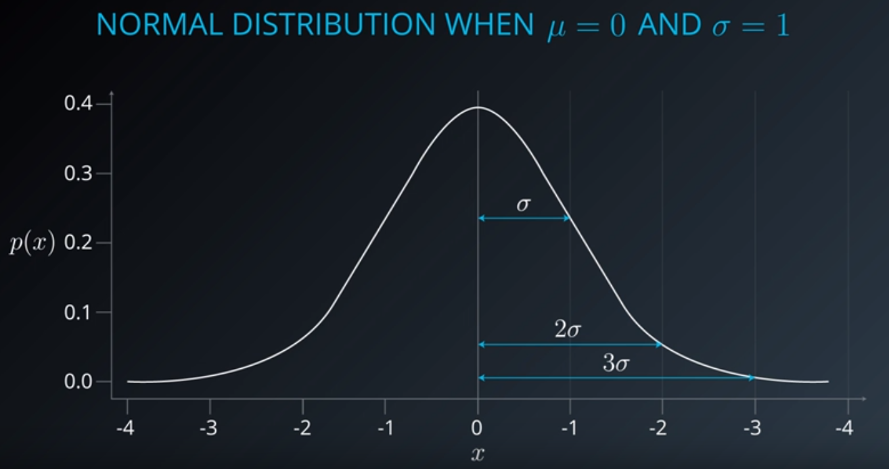
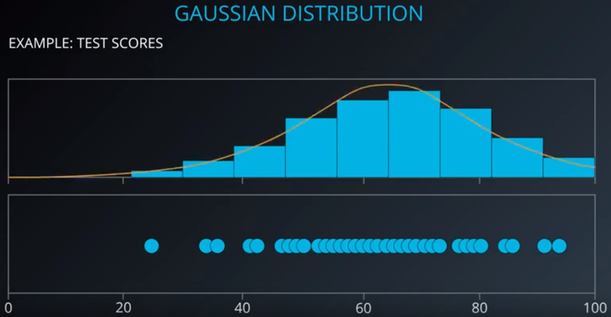
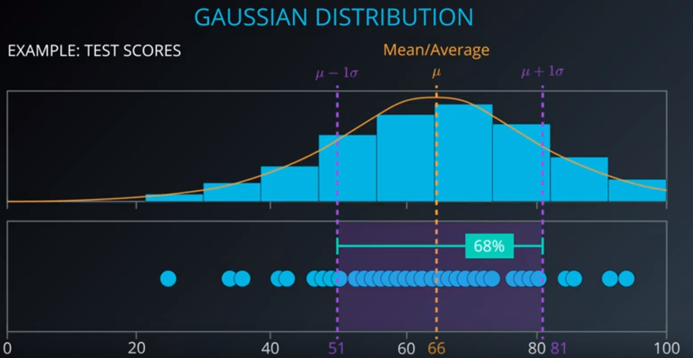
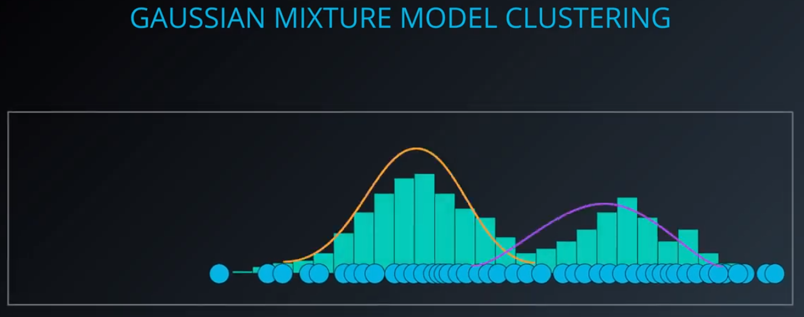
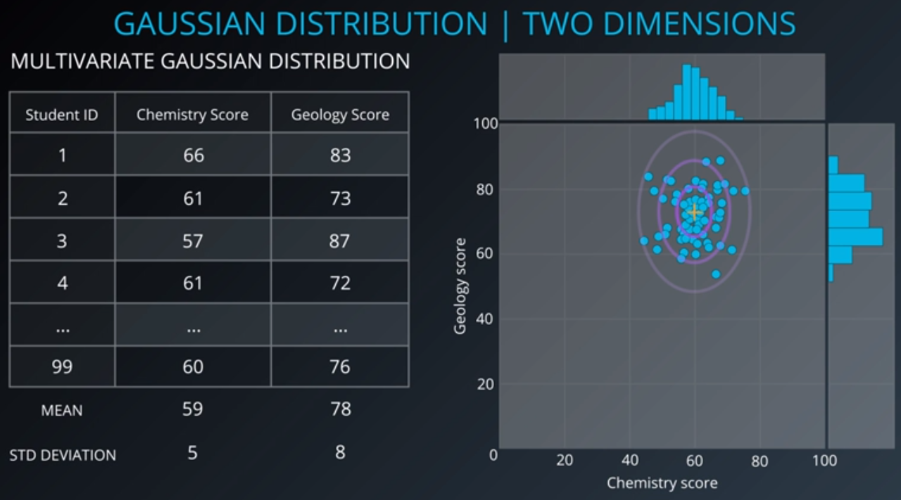
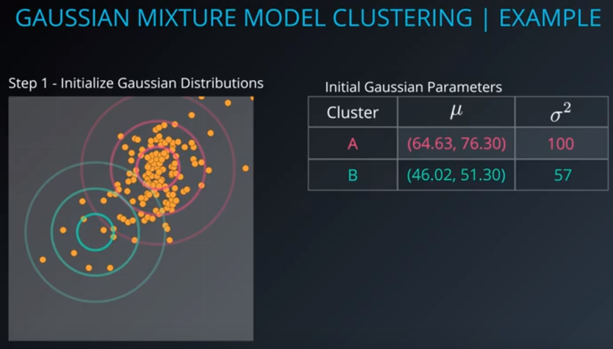
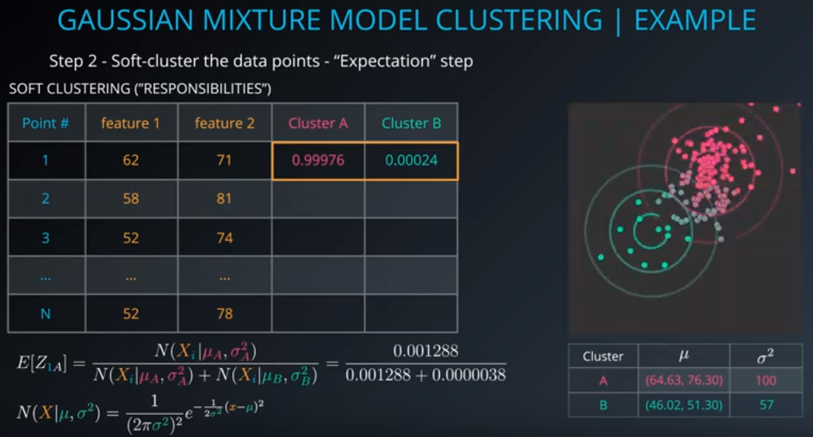

# ND025 - Supervised Learning - Lesson 04

#### Tags
* Author : AH Uyekita
* Title  :  _Gaussian Mixture Models and Cluster Validation_
* Date   : 10/04/2019
* Course : Data Scientist Nanodegree Program
    * COD    : ND025-br
    * **Instructor:** Jay Alammar

***

## Gaussian Mixture Models Clustering

This is a soft clustering algorithm, which calculates for each point/observation the membership for every cluster. The highest membership will determine the cluster of that point. Figure 1 shows it.

<em>
Figure 1 - GMM Example.
</em>

To facilitate the interpretation, let's visualize an 1D example. In Figure 2, you can see "two groups" of points.

<em>
Figure 2 - 1D Example.
</em>

Each group could be modeled as an output of two different Gaussian Distribution. To turn it a bit more realistic, Figure 3 shows it in a 2D example.

<em>
Figure 3 - 2D Example.
</em>

The GMM accomplish the clusterization based on the idea of each cluster has your own distribution, thus the GMM is based on the Gaussian Distribution. Figure 4 shows the Normal Distribution also known as Gaussin Distribution.

<em>
Figure 4 - Gaussian Distribution.
</em>

#### Gaussian Distribution Recap

Analysing one dimension feature, you can use the histogram to aid the visualization. As you can see in Figure 5.

<em>
Figure 5 - Bell Curve and Histogram of 1D Feature.
</em>

The bandwidth between the average (delimited by the standard deviations) represents 68% of the points in the dataset. This is a property of the Gaussian Distribution.

<em>
Figure 6 - Standard Deviation and Percentage of Points.
</em>

If you increase the bandwidth to 2 standard deviations around the average, the region will comprise 95%. Lastly, if you have chosen 3 three standard deviations the region reaches 99%.

Now, let's dive in using two dimensions represented in one dimension (like a projection).

<em>
Figure 7 - Two Gaussians Distributions.
</em>

Adopting a 2D representation, you can plot the variables Chemistry Score and Geology Score on X and Y axis. This is the case of a Multivariate Gaussian Distribution.

<em>
Figure 8 - Multivariate Gaussian Distribution.
</em>

### Expectation - Maximization for Gaussian Mixtures

The steps to perform the GMM Clustering.

* <kbd>STEP 1</kbd> - Initialize K Gaussian Distribuions;
* <kbd>STEP 2</kbd> - Soft-Cluster Data - **Expectation**;
* <kbd>STEP 3</kbd> - Re-estimate the Gaussians - **Maximization**;
* <kbd>STEP 4</kbd> - Evaluate Log-likelihood to check for convergence, and;
* Repeat from <kbd>STEP 2</kbd> until converged.

#### Example

##### Step 1

In this case we have used the random initialization. We assume some values to use as averages and standard deviations.

<em>
Figure 9 - Parameters Initialization.
</em>

For this example I have assumed:

|Cluster|Average feature 1|Average feature 2|Standard Deviation|
|:-:    |:-:              |:-:              |:-:               |
|A      |64.63            |76.30            |100               |
|B      |46.02            |51.30            |57                |

##### Step 2 - Expectation

In this Step we are going to calculate the cluster memberships values for each points. First, we need to calculate the likelihood using the Equation (1):

$$N(X|\mu,\sigma^2) = \frac{1}{2 \pi \sigma^2} e^{-\frac{1}{2 \pi \sigma} (X - \mu)^2 } \tag{1}$$

Thereafter, it is necessary to normalize the results using the Equation (2).

$$E[Z_{1A}] = \frac{N(X|\mu_A,\sigma^2_A)}{N(X|\mu_A,\sigma^2_A) + N(X|\mu_B,\sigma^2_B)} \tag{2}$$

Figure 10 shows an example of how to apply it.

<em>
Figure 10 - Calculating the Maximum Expectation.
</em>

$$N(X_1 = 62|\mu_A = 64.63, \sigma^2 = 100) = \frac{1}{\sqrt{2 \pi 100^2}} e^{-\frac{1}{2 \pi 100} (62 - 64.63)^2} = 0.001336$$

$$N(X_1 = 71|\mu_B = 76.30, \sigma^2 = 57) = \frac{1}{\sqrt{2 \pi 100^2}} e^{-\frac{1}{2 \pi 100} (62 - 64.63)^2} = 0.00000987$$

##### Step 3

##### Step 4

## Cluster Validation

This is procedure to evaluate the Clustering results. There are three categories of Cluster Validation.

.
